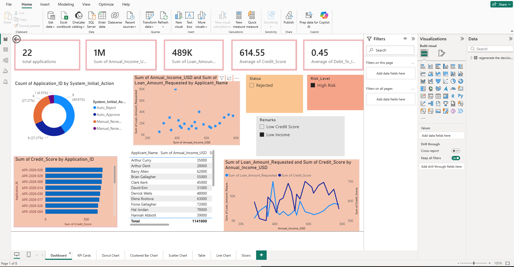
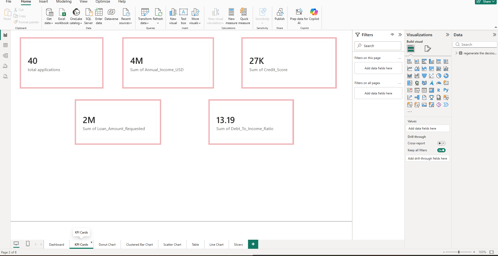
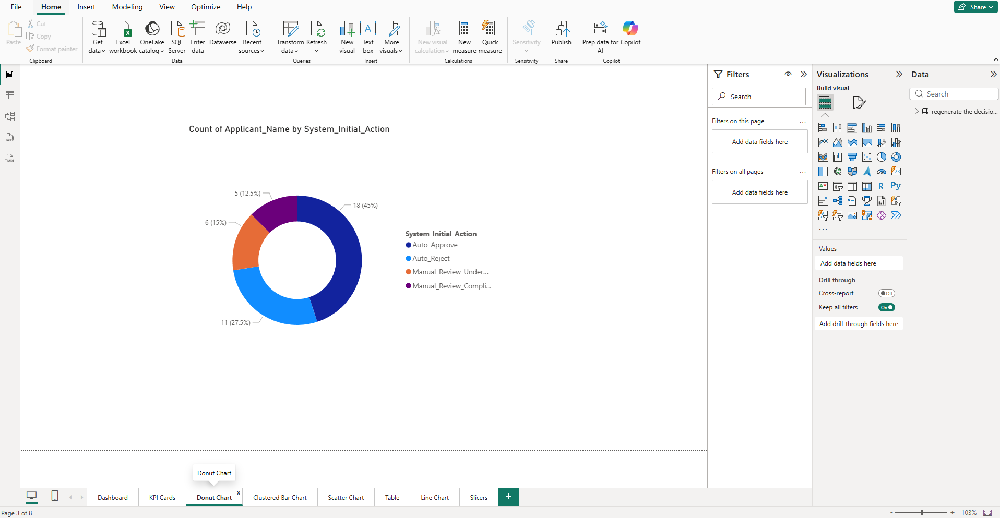
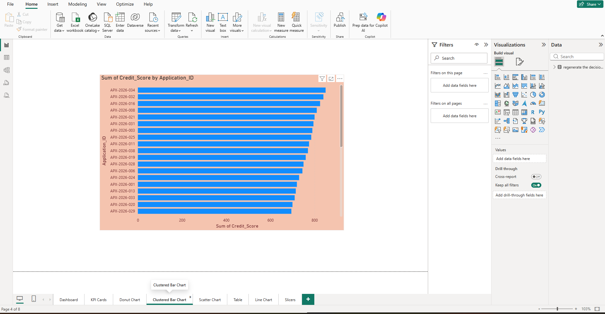
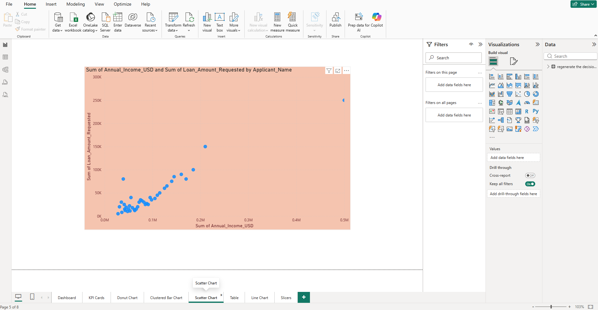

# Business Intelligence Performance Dashboard

An interactive, end-to-end Business Intelligence dashboard designed to translate complex raw data into actionable enterprise insights. This analytical tool enables stakeholders to track high-level corporate performance, monitor profitability drivers, analyze distribution trends, and drill down into granular transactional data in real time.

## 🖥️ Full Dashboard Overview

Below is the complete overview of the analytical control panel:



---

## 📊 Individual Visual Components & Breakdown

To highlight the granular design architecture of this reporting tool, the dashboard is broken down into specific component visual blocks:

### 1. High-Level KPI Summary Cards
Tracks business-critical health indicators at a glance, providing immediate baseline performance comparison against set targets.


### 2. Slicers & Global Filter Panel
Dynamic control elements allowing end-users to instantly slice performance metrics across specific time periods, regions, or product segments.


### 3. Share-of-Wallet Donut Chart
Breaks down macro metrics into categorical proportions, making it easy to identify top-performing business units or contribution mixes.


### 4. Categorical Comparative Bar Chart
A structured ranking visualization displaying absolute metric performance across different operational segments or entities.


### 5. Multi-Variable Correlation Scatter Chart
Maps distributions to isolate clusters, outperforming segments, or system anomalies by plotting variables against intersecting variance axes.


### 6. Variance Breakdown Waterfall Chart
Step-by-step visual bridge showing how positive increments and negative leakages transition a starting balance into a final target value.


### 7. Granular Transactional Details Table
A fully formatted matrix providing row-by-row visibility for direct audit verification and data integrity checks.


---

## 🛠️ Data Architecture & Key Features

* **Dynamic Filtering**: Global cross-filtering enables selecting any metric data point in one chart to instantly filter all surrounding visuals.
* **Optimized Data Model**: Built with a clean star schema separating dimensional lookups from numerical fact tables to optimize load performance.
* **User-Centric UX**: Standardized color palettes, clear visual hierarchy, and whitespace balance ensure insights are discoverable at a glance.

---

## ⚙️ Quick Installation & Interaction Guide

1. Clone this repository to your computer:
   ```bash
   git clone [https://github.com/your-username/your-dashboard-repo.git](https://github.com/your-username/your-dashboard-repo.git)
